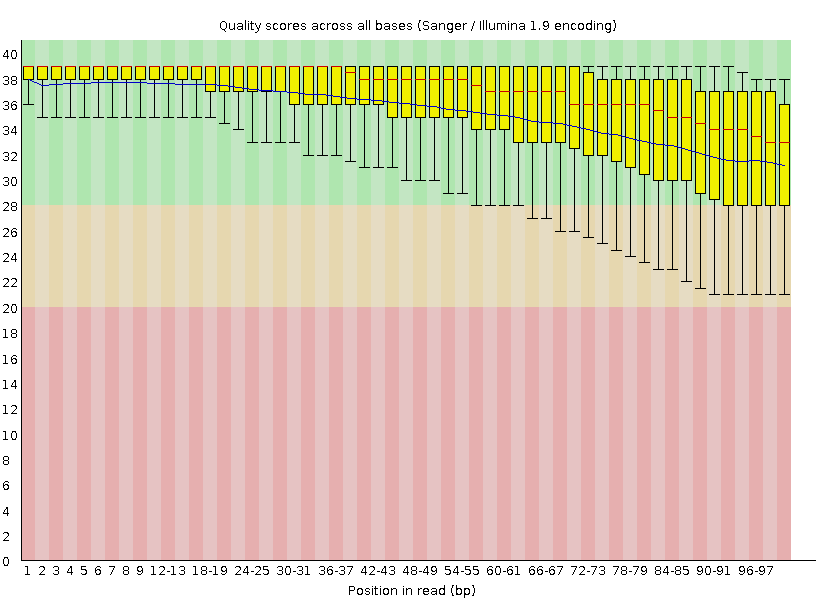
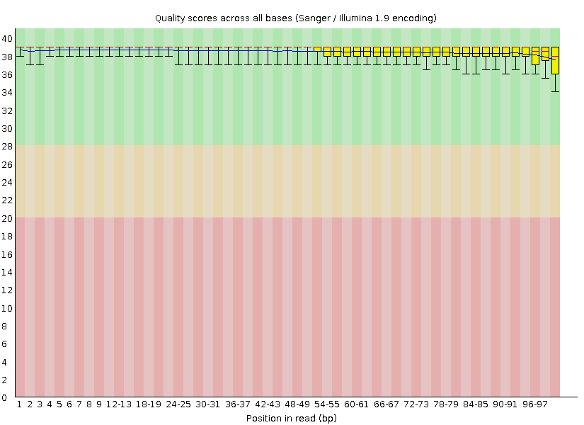

# Trimmomatic
This is a counterpart of Trimmomatic written in python3.x

## Examples
Before

After

## Prerequisites
- python3.x interpretator
- argparse library

## Usage
There are several flags which you can use

-h, --help show this help message and exit

  -i <path to file>, --input <path to file>
                        path to file
                        
  -o <path to output>, --output <path to output>
                        path to output
                        
  -s <1-sequence length>, --start <1-sequence length>
                        number of nucleotide to crop from start
                        
  -e <1-sequence length>, --end <1-sequence length>
                        number of nucleotide to crop from end
                        
  -w <1-sequence length>, --sliding-window <1-sequence length>
                        size of sliding window
                        
  -q <phred quality>,
                        necessary mean quality of fragment at sliding window
                        
  -v, --version         show program's version number and exit

## Version
0.2.0

## Authors
Alexander Ilin

## License
BI